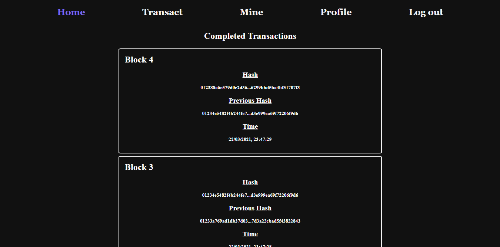

# Cray coin

A full fledge blockchain coin named cray with [Flask](https://flask.palletsprojects.com/en/1.1.x/) backend, [ReactJS](https://reactjs.org/) for frontend, [MongoDB](https://www.mongodb.com/) for storing and [Firebase](https://firebase.google.com) for authentication and Log in functionality.


## Installation

Start with a fresh installation of python, preferably using Anaconda, and then inside the blockchain-folder run the following line to install all python required dependencies.

```
pip install -r requirements.txt
```

You will also need a firebase account to enable the authentication. Create a new web project with the firebase console, enable the Google auth log in from the options and create a .env file in the [frontend folder](src/frontend) as the [.env.example file](src/frontend/.env.example) and put the firebase config file values in the REACT_APP variables.

## Usage


Inside the [backend folder](src/backend) run the following code to start the backend server where all the blockchain and the transactions are happening.

```
flask run
```

Assuming you have [npm](https://www.npmjs.com/) installed, inside the [frontend folder](src/frontend) run the following code to start the frontend page.

```
npm start
```

Finally for the storing you will need [MongoDB](https://www.mongodb.com/) installed. For windows open a terminal and type the following code to start the mongodb.

```
mongod
```

If it is installed you will see a big output. More info in [MongoDB/Installation](https://docs.mongodb.com/manual/tutorial/install-mongodb-on-windows/).

## Example

The frontend page provides a UI for making transactions, monitoring the public ladger, mine blocks and watch your profile and amount.

<p align="center">
   
</p>
